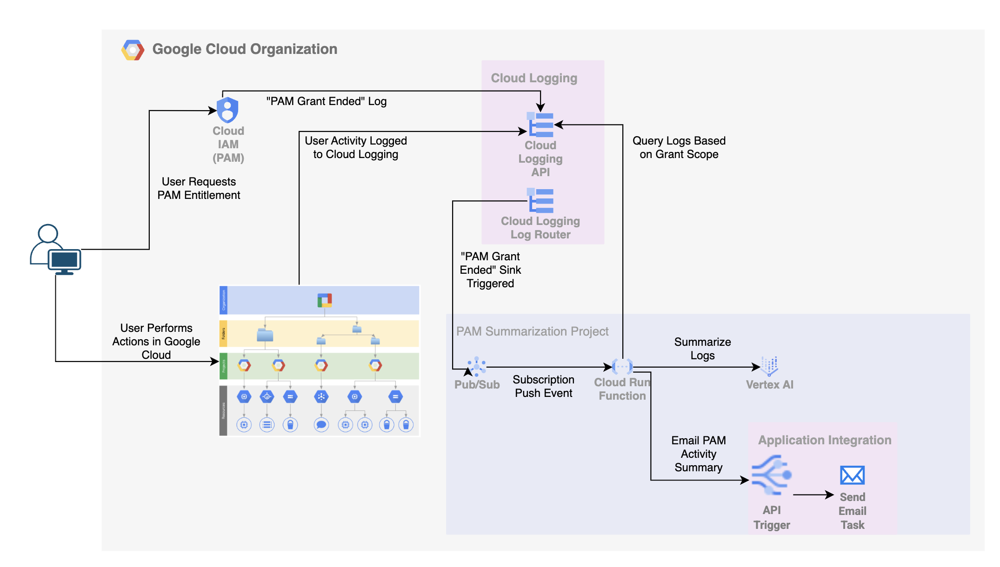

# Google Cloud PAM Activity Summary
This project aims to provide a tool for summarizing user activity that occurred during a grant issued by Google Cloud's [Privileged Access Manager (PAM)](https://cloud.google.com/iam/docs/pam-overview) service. Google Cloud's PAM provides just-in-time privileged access management, allowing for temporary elevation of permissions with comprehensive audit logs. However, analyzing these audit logs to understand the actions taken during a specific grant can be time-consuming.

The goal of this project is to:
- Fetch PAM Grant Information: Retrieve details about specific PAM grants, including the granted roles, resources, and timeframes.
- Collect Audit Logs: Analyze Google Cloud audit logs to identify events related to the specified grant.
- Summarize User Activity: Generate a concise summary of the actions performed by the user during the grant period.
- Send a Notification: Email a summary of the activty to a user/group in the organization responsible for periodically reviewing user activity.

### Architecture



### Setup PAM Summarization Project
```bash
#Setup Variables
export PROJECT_NAME=pam-summary
export REGION=[REGION, e.g. 'us-central1']
ORGANIZATION_ID=[GCP_ORG_ID]
BILLING_ACCOUNT=[GCP_BILLING_ID]
TOPIC_ID='pam-events-topic'
SINK_NAME='pam-events-sink'
CLOUD_RUN_SERVICE='cloud-run-pam'
SUMMARY_RECIPIENT=[EMAIL]

if [ -z "${PROJECT_ID}" ]
then
  PROJECT=$(gcloud projects list --filter=name:${PROJECT_NAME})
  if [ -z "${PROJECT}" ]
  then
    RANDOM_PROJECT_SUFFIX=$(cat /dev/urandom | tr -dc 'a-z0-9' | fold -w 6 | head -n 1)
    printf 'Y' | gcloud projects create ${PROJECT_NAME}-${RANDOM_PROJECT_SUFFIX} --name=${PROJECT_NAME} --organization=${ORGANIZATION_ID}
    while [[ -z "${EXISTS}" ]]; do
      EXISTS=$(gcloud projects list --filter=name:${PROJECT_NAME} --format 'value(PROJECT_ID)')
      sleep 1
    done
  fi
  export PROJECT_ID=$(gcloud projects list --filter=name:${PROJECT_NAME} --format 'value(PROJECT_ID)')
  export PROJECT_NUMBER=$(gcloud projects list --filter=name:${PROJECT_NAME} --format 'value(PROJECT_NUMBER)')
fi
gcloud beta billing projects link ${PROJECT_ID} --billing-account=${BILLING_ACCOUNT}

gcloud config set project ${PROJECT_ID}

printf 'y' |  gcloud services enable cloudresourcemanager.googleapis.com
printf 'y' |  gcloud services enable container.googleapis.com
printf 'y' |  gcloud services enable artifactregistry.googleapis.com
printf 'y' |  gcloud services enable cloudbuild.googleapis.com
printf 'y' |  gcloud services enable containerscanning.googleapis.com
printf 'y' |  gcloud services enable run.googleapis.com
printf 'y' |  gcloud services enable cloudfunctions.googleapis.com
printf 'y' |  gcloud services enable aiplatform.googleapis.com
printf 'y' |  gcloud services enable integrations.googleapis.com
printf 'y' |  gcloud services enable cloudasset.googleapis.com

gcloud auth application-default set-quota-project ${PROJECT_ID}
```

### Setup Targetted Org-level Log Sink to Pub/Sub Topic
```bash
gcloud pubsub topics create $TOPIC_ID

gcloud logging sinks create $SINK_NAME \
  pubsub.googleapis.com/projects/${PROJECT_ID}/topics/${TOPIC_ID} --include-children \
  --organization=$ORGANIZATION_ID \
  --log-filter="proto_payload.method_name="PAMEndGrant""

gcloud pubsub topics add-iam-policy-binding $TOPIC_ID \
--member=serviceAccount:service-org-${ORGANIZATION_ID}@gcp-sa-logging.iam.gserviceaccount.com \
--role='roles/pubsub.publisher'

### Project-level Cloud Run Service Account Permissions
gcloud projects add-iam-policy-binding ${PROJECT_ID} \
--member=serviceAccount:${PROJECT_NUMBER}-compute@developer.gserviceaccount.com \
--role='roles/logging.logWriter'

gcloud projects add-iam-policy-binding ${PROJECT_ID} \
--member=serviceAccount:${PROJECT_NUMBER}-compute@developer.gserviceaccount.com \
--role='roles/aiplatform.user'


### Org-level Cloud Run Service Account Permissions
gcloud organizations add-iam-policy-binding ${ORGANIZATION_ID} \
--member=serviceAccount:${PROJECT_NUMBER}-compute@developer.gserviceaccount.com \
--role='roles/privilegedaccessmanager.viewer' \
--condition='None'

gcloud organizations add-iam-policy-binding ${ORGANIZATION_ID} \
--member=serviceAccount:${PROJECT_NUMBER}-compute@developer.gserviceaccount.com \
--role='roles/logging.viewer' \
--condition='None'
```

### Deploy Cloud Run Function and Pub/Sub Subscription
```bash 
gcloud projects add-iam-policy-binding ${PROJECT_ID} \
    --member=serviceAccount:${PROJECT_NUMBER}-compute@developer.gserviceaccount.com \
    --role=roles/cloudbuild.builds.builder

gcloud functions deploy ${CLOUD_RUN_SERVICE} \
--gen2 \
--project=${PROJECT_ID} \
--region=${REGION} \
--runtime='python312' \
--source=./src \
--entry-point='index' \
--ingress-settings=internal-only \
--no-allow-unauthenticated \
--trigger-http \
--memory=512M \
--set-env-vars PROJECT_ID=${PROJECT_ID},SUMMARY_RECIPIENT=${SUMMARY_RECIPIENT},REGION=${REGION}

gcloud iam service-accounts create ${CLOUD_RUN_SERVICE}-invoker \
    --display-name "Cloud Run PAM Summary Pub/Sub Invoker"

gcloud run services add-iam-policy-binding $CLOUD_RUN_SERVICE \
--region ${REGION} \
--member=serviceAccount:${CLOUD_RUN_SERVICE}-invoker@${PROJECT_ID}.iam.gserviceaccount.com \
--role=roles/run.invoker

gcloud projects add-iam-policy-binding ${PROJECT_ID} \
   --member=serviceAccount:service-${PROJECT_NUMBER}@gcp-sa-pubsub.iam.gserviceaccount.com \
   --role=roles/iam.serviceAccountTokenCreator

gcloud pubsub subscriptions create pam-event-subscription --topic ${TOPIC_ID} \
--ack-deadline=600 \
--push-endpoint=https://${CLOUD_RUN_SERVICE}-${PROJECT_NUMBER}.${REGION}.run.app \
--push-auth-service-account=${CLOUD_RUN_SERVICE}-invoker@${PROJECT_ID}.iam.gserviceaccount.com
```

### Create Application Integration Specification for Email Summaries
```bash
#Create Application Integration in Region
curl -X POST \
-H "authorization: Bearer $(gcloud auth print-access-token)" \
-H "Content-Type: application/json" \
"https://${REGION}-integrations.googleapis.com/v1/projects/${PROJECT_ID}/locations/${REGION}/clients:provision"

#Upload Specification and Publish
uploaded_spec="$(curl --silent -X POST \
-H "authorization: Bearer $(gcloud auth print-access-token)" \
-H "Content-Type: application/json" \
-d @application_integration_config.json \
"https://${REGION}-integrations.googleapis.com/v1/projects/${PROJECT_ID}/locations/${REGION}/integrations/pam-summary-email/versions")"

version=$(echo ${uploaded_spec} | jq -r .name | sed 's:.*/::')

curl -X POST \
-H "authorization: Bearer $(gcloud auth print-access-token)" \
-H "Content-Type: application/json" \
"https://${REGION}-integrations.googleapis.com/v1/projects/${PROJECT_ID}/locations/${REGION}/integrations/pam-summary-email/versions/${version}/:publish"

## Application Integration Email Summary
gcloud projects add-iam-policy-binding $PROJECT_ID \
   --member=serviceAccount:${PROJECT_NUMBER}-compute@developer.gserviceaccount.com \
   --role=roles/integrations.integrationInvoker
```

### Update Summary Email Recipient
```bash
gcloud functions deploy ${CLOUD_RUN_SERVICE} --update-env-vars SUMMARY_RECIPIENT=[INSERT EMAIL/DISTO]
```

### Clean up (Remove Project and Org-level Permission Bindings and Log Sink)
```bash
printf 'y' |  gcloud logging sinks delete ${SINK_NAME} \
  --organization=${ORGANIZATION_ID}

gcloud organizations remove-iam-policy-binding ${ORGANIZATION_ID} \
--member=serviceAccount:${PROJECT_NUMBER}-compute@developer.gserviceaccount.com \
--role='roles/privilegedaccessmanager.viewer' \
--condition='None'

gcloud organizations remove-iam-policy-binding ${ORGANIZATION_ID} \
--member=serviceAccount:${PROJECT_NUMBER}-compute@developer.gserviceaccount.com \
--role='roles/logging.viewer' \
--condition='None'

printf 'y' |  gcloud projects delete ${PROJECT_ID}
```

### License:

This is not an official Google Product.

This project is licensed under the MIT License.